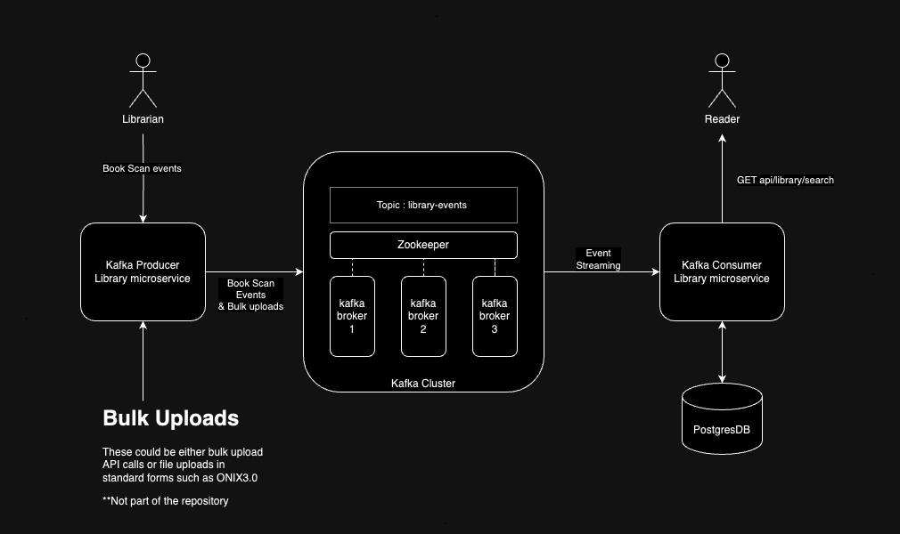

# README FIRST!

Welcome to the spring-boot-kafka producer & consumer samples with Springboot. The prupose of this project is to explore apache kafka configuration using SpringBoot V3. 

## Overview

This repository explores the features of Springboot to integrate Apache kafka event streaming

## Component Diagram

The diagram below self-explanatory and represents the high level components which are created by this project



## Quickstart

The simplest way to run the project is to run the `docker-compose.yml` file in the root directory. This docker compose file consists all the individual servers needed to run the entire application components , which includes the following list of server components
```bash
docker compose up
```

IMPORTANT : If tyou are running project in local and try to update the docker images in the repo then please take the following steps :
1. Make sure that root pom.xml has correct user listed in the docker hub registry url e.g. 
2. Go to the root directory and execute the following command to compile, build and upload new images to the docker registry publicly.
```bash
./mvnw clean compile jib:build -d 
```

**#Data stores**
- postgres-library => image: postgres:latest

**#Event Brokers**
- zookeeper => image: confluentinc/cp-zookeeper:latest
- kafka1 => image : confluentinc/cp-kafka:latest
- kafka2 => image : confluentinc/cp-kafka:latest
- kafka3 => image : confluentinc/cp-kafka:latest


**#Spring boot Service Containers**

- kafka-producer => image: technolearn/kafka-producer:latest
- kafka-consumer => image: technolearn/kafka-consumer:latest

```bash
docker compose up -d #Because the file name is docker-compose.yml, you do not have to provide filename
```

## Quick Access Links 

Once the application is up and running after executing the `docker compose up -d` command(Running all the spring boot services in their own containers) we can acces the links given below. 

 
1. POST Service for creating library book scan events(Please note that the data needs to be populated manually) : http://localhost:9000/api/books   
2. Search books by name & author in library-service : http://localhost:9001/api/library/search?q=bookNameOrAuthorNameHere

## Other Handy shortcuts
1. Postman collection which sample request and response for the aforemention API calls can be found in the folder [postman-collection](./postman-collection)
2. Useful Kafka commands to validate local setup using [docker-compose-kafka.yml](./docker-compose-kafka.yml) can be found in the file [KafkaCommands.md](./KafkaCommands.md)

## Testing

To run the junit tests, open a terminal and go to the root directory and make use of the maven wrapper to run the maven test target as given below.

```bash
./mvnw clean test
```

## TODOs

1. Create file based bulk uploads of library events/inventory
2. Secured connection in between Kafka clusters and producer/consumer

## References

- [Auto generated references through SpringBoot Initializer](./HELP.md)
- [Spring for Apache Kafka](https://docs.spring.io/spring-kafka/reference/)
- [Apache Kafka for Developers using Spring Boot](https://www.udemy.com/course/apache-kafka-for-developers-using-springboot/)